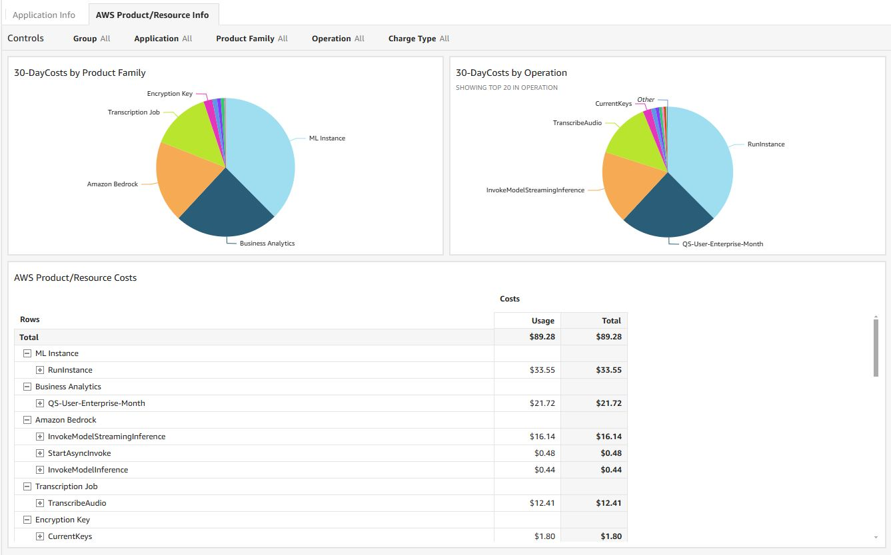

# AWS CUR Resource Analyzer  
Amazon QuickSight resources to be used along with  [CUDOS Cloud Intelligence Dashboards](https://github.com/aws-samples/aws-cudos-framework-deployment) to analyze AWS [Cost and Usage Report (CUR)](https://docs.aws.amazon.com/cur/latest/userguide/what-is-cur.html) Data Exports.

## Dependencies  
This stack **<ins>must be</ins>** installed after CUDOS has been successfully deployed. It depends on [automated CUR updates and ingestion](https://catalog.workshops.aws/well-architected-cost-optimization/en-US/2-expenditure-and-usage-awareness/60-automated-cur-updates-and-ingestion) from the Cloud Intelligence Dashboards and should be installed in the same account.

## Installation
Users should follow the directions in the [AWS CloudFormation User Guide](https://docs.aws.amazon.com/AWSCloudFormation/latest/UserGuide/cfn-console-create-stack.html) to create a stack from the CloudFormation console using the [cur_resource_analyzer_cloudformation.json](cloudformation/cur_resource_analyzer_cloudformation.json) file in this repository.

[](https://us-east-1.console.aws.amazon.com/cloudformation/home?region=us-east-1#/stacks/quickcreate?templateURL=https%3A%2F%2Faws-cur-resourceanalyzer.s3.us-east-1.amazonaws.com%2Fcur_resource_analyzer_cloudformation.json&stackName=cur-resource-analyzer&param_CurAppNameCol=product_servicecode&param_CurDbName=cur&param_CurTableName=customer_all)

## Parameters  
- **CurDbName** - The name of the CUR database. This information can be found in Athena.
- **CurTableName** - The name of the CUR table. This information can be found in Athena.
- **CurAppNameCol** - The name of the CUR column containing application name tag info. This information can be found in Athena. Leave as```product_servicecode```if app-level [tagging](https://docs.aws.amazon.com/tag-editor/latest/userguide/best-practices-and-strats.html) is unavailable.

**Note**: See the following AWS Well-Architected Cost Optimization Workshop for help with [Cost and Usage Analysis - SQL](https://catalog.workshops.aws/well-architected-cost-optimization/en-US/2-expenditure-and-usage-awareness/70-cost-and-usage-analysis-sql) in Athena.

## Other Information
**Account Groups**  
Groups in the analysis refer to account groups that are split by grouping linked accounts that have similar names. The groupings depend on the presence of basic string delimeters and use the following [QuickSight function](https://docs.aws.amazon.com/quicksight/latest/user/toLower-function.html):```toLower(split(replace({account_name},':','-'),'-',1))```.

**QuickSight Permissions**  
QuickSight users will need to be granted access to the newly created assets. Directions for this process can be found in the [Amazon Quicksight User Guide - Managing assets](https://docs.aws.amazon.com/quicksight/latest/user/manage-qs-assets.html) section.

## Screenshots


## Disclaimer
This code was created for educational purposes and should be analyzed, modified and tested in your own environment prior to any production use.
